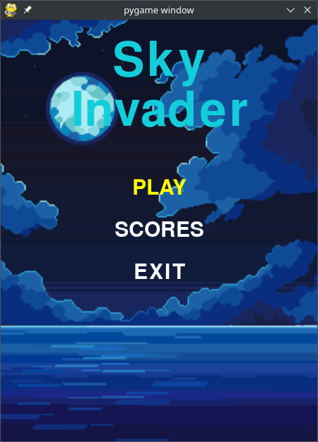
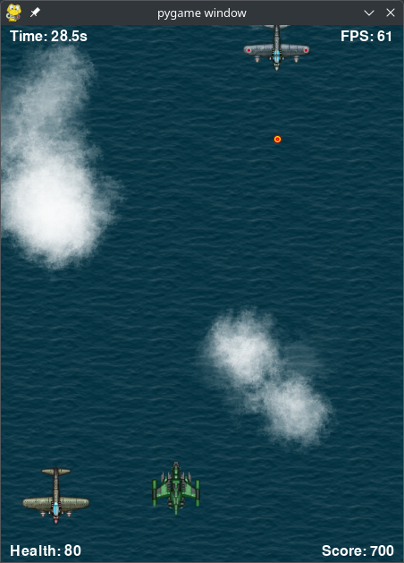

# About
Sky Invader is a 2D arcade game developed with Pygame, project made for college. The game has one level and goes indefinitely until the player is destroyed. The score is saved with SQLite.

You can download the game from the [releases](https://github.com/gabrielpdmello/sky-invader/releases) tab.

## Controls
- Arrow keys to move;
- Left control or space to fire;
- P to pause game;
- M to mute music.

Game menu

Gameplay

